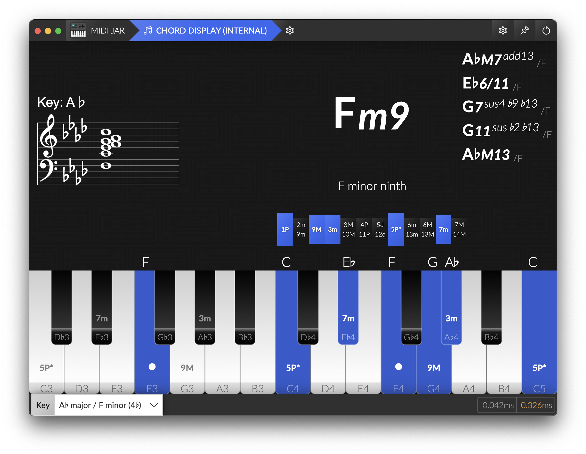
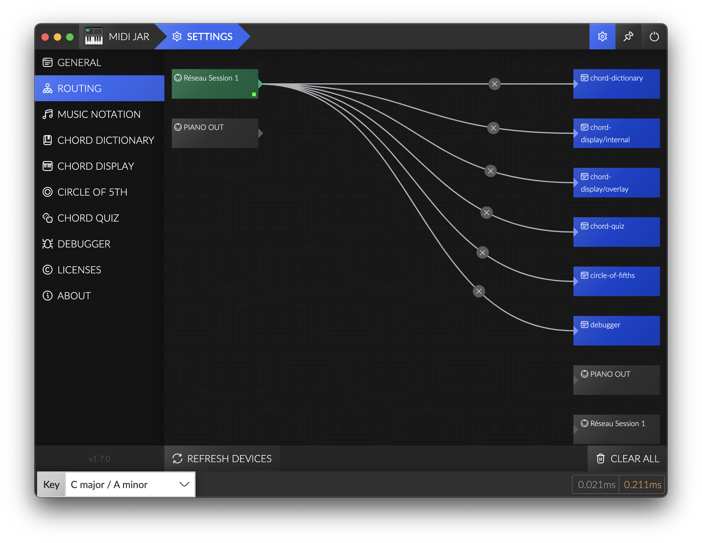

# [MIDI Jar](https://github.com/la-jarre-a-son/midi-jar)

MIDI Jar is a tool box for musicians, learners, streamers, that want to route MIDI message between devices, and display a piano or monitor chords while playing, and integrate it on a video or on a Twitch stream with OBS.



## Releases

Check out the releases on Github: [Releases](https://github.com/la-jarre-a-son/midi-jar/releases)

### Unsigned App

Due to code sign certificates being a bit expensive, MIDI Jar is not signed (yet?).
If you are willing to help me sign this app, financially, don't hesitate to contact me.

So to install it on **Windows**, Windows Defender may block it, and warn you that this could be dangerous. You can still execute it anyway.

On **MacOS** though, the _.dmg_ or any downloaded unsigned file will be blocked, as if "app is damaged and can’t be opened".

You will need to unquarantine the file after you downloaded, by executing in a terminal:

```
xattr -dr com.apple.quarantine <Your Downloaded File Name>
```

## Why this app ?

I needed a way to display a piano and monitor chords when i was playing, but found no solution to do it properly.
So I created a previous tool called [Chord Display](https://github.com/rednetio/chord-display) to do it in a Web browser, but due to Windows having exclusive MIDI (only one software can use the same MIDI device at a time), I needed a new solution.
Plus, OBS BrowserSource is unable to use MIDI devices, so integrating it in a Twitch stream was not possible.

MIDI Jar fixes all theses issues as a Standalone Desktop Application made with Electron.

## Features

MIDI Jar includes:

- MIDI routing between devices and internal modules
- A Chord Display module, to display a piano and monitor chords being played
- A HTTP/Websocket server to include modules externally (in OBS Browser source for instance)
- Running at startup
- Running in background (no window, only Tray icon)

## Routing

You can route MIDI between devices, or to internal and external modules of MIDI Jar, and MIDI messages will be routed when the application is running.

This can be a simple alternative to replace complex softwares like **MIDI-OX** if you _just_ want to route messages from a device to another.

### NOTE FOR WINDOWS USERS:

Windows Standard MIDI drivers are exclusive, only one software can be connected to a device at the same time.

**If you want to use MIDI Jar with other sofwares like your DAW, or a Standalone VST, you should install [loopMIDI](https://www.tobias-erichsen.de/software/loopmidi.html) by Tobias Erichsen.**

You will be able to create multiple Virtual MIDI devices (loopbacks) and route MIDI messages to it. Plus, those virtual devices are non-exclusive, so multiple softwares can use them.



### Latency

MIDI Jar may introduce latency to MIDI messages. I did my best to keep it as low as possible, in the Routing settings page you can see the latency that is introduced by your config: this is only the latency added to the existing latency, from when MIDI Jar receives a message, and forwarded it to other devices and modules.

Any other latency (due to USB, your device drivers or LoopMidi loopback) is not taken into account.

My tests had an `average additional latency < 0.2ms` but this can vary a lot with PC configuration, routing, and CPU Usage, and some freezes could occur.

## Chord Display

Chord Display is a module of MIDI Jar for displaying a piano keyboard and the chords played.

It uses the detect feature from [tonal](https://github.com/tonaljs/tonal).

To use it, route your MIDI devices to the internal `chord-display` output.

### Music Notation

You can enable displaying the standard music notation in Chord Display.

It is implemented with [VexFlow](https://github.com/0xfe/vexflow) and supports displaying notes in any major Key.

NOTE: Key signature that would have more than 7 alterations will be changed automatically to the equivalent major key (e.g. `G#` will produce a key signature of `Ab`).

**
DISCLAIMER: As i am not really into reading and writing music, Chord Display notation could be wrong... If so, do not hesitate to post an issue.
**

### Customize in Settings

Chord Display rendering is customizable in the Settings:

- Fundamentals:
  - Key Signature
  - Accidentals (when in C Key): displays `flats` ♭ or `sharps` ♯
- Keyboard:
  - Theme:
    - `classic` - a classical looking piano
    - `flat` - a simplified version on a single row
  - Keyboard size: start & end note
  - Colors: blacks and whites, and pressed notes.
  - Enabling some infos on the piano:
    - `key names` - name of the notes
    - `chord degrees` - degrees of each note of the detecterd chord
    - `tonic` - a little dot on the chord tonic
- Enabling elements:
  - `chord` - the detected chord
  - `notation` - the music notation of the played notes
  - `piano` - a keyboard displaying your played notes
  - `alternative chords` - a list of other detected chord names if any

### Customize via CSS

OBS Browser Source let you inject any CSS in the page, so you can add any style to existing layout, like:

Remove detected Chord:

```css
#chord {
  display: none;
}
```

Remove Bass Note / Slash chord / Compound chord notation:

```css
.chord-root {
  display: none;
}
```

Remove played Notes:

```css
#notes {
  display: none;
}
```

Remove piano keyboard:

```css
#keyboard {
  display: none;
}
```

Change display order:

```css
#keyboard {
  order: 1;
}
#chordDisplayContainer {
  order: 2;
}
#notes {
  order: 3;
}
```

Change Text Color:

```css
body {
  color: #fff;
  background: transparent;
}
```

Change chord size and placement:

```css
#chordDisplay {
  align-items: flex-end;
  justify-content: flex-end;
  padding: 2vh;
  flex-direction: column-reverse;
}

#chordDisplayContainer {
  align-items: flex-start;
  justify-content: space-between;
}

#chord {
  flex-grow: 0;
  font-size: 10vh;
}

#notes {
  display: none;
}

#alternativeChords {
  display: none;
}

#notation {
  color: black;
  width: 300px;
  height: 300px;
  background: rgba(255, 255, 255, 0.3);
  border-radius: 32px;
  margin-top: 16px;
}
```

## HTTP/WS Server - Overlay

It enables integrating modules in an external web browser, or in an OBS Browser Source. For instance, you can integrate MIDI Jar in your Twitch stream, or load it on a different computer or phone for displaying chords while jamming, and even use it as a Desktop Wallpaper using [Lively Wallpaper](https://rocksdanister.github.io/lively/).

Chord Display module has dedicated settings if you need a different rendering when using external access, and they are automatically synced when you change them.

To use it, route your MIDI devices to the overlay `chord-display` output.

## What then ?

### Build

This project is built with Electron & Webpack:

```
npm install

npm run start
 -or-
npm run package
```

### Planned features / Ideas

- [x] Simple Routing (v1)
- [x] Chord Display (v1)
- [x] HTTP/WS overlay for OBS (v1)
- [x] Display Standard notation
- [ ] More Keyboard themes
- [ ] Virtual Keyboard (use pc keyboard as a MIDI device)
- [ ] Chords Quiz
- [ ] Visualizations / Vertical scrolling notes
- [ ] Soundboard
- [ ] MIDI recording (playback/backup)
- [ ] Chromesthesia
- [ ] Advanced Routing (split keyboard, filter, velocity/value remapping)

### Contribute / Bugs

This project is fully open to contribution and it would be appreciated to have some feedbacks and new ideas.
Please feel free to open an issue or open a Merge request.

For any UI or UX bug, please [Open an issue](https://github.com/la-jarre-a-son/midi-jar/issues).

If you discover unexpected Chord detection, please see [tonaljs/tonal issues](https://github.com/tonaljs/tonal/issues) and contribute to make it work perfectly.

### Credits

- [tonal](https://github.com/tonaljs/tonal): A functional music theory library for Javascript, that detects chords, and handles MIDI notes
- [VexFlow](https://github.com/0xfe/vexflow): A JavaScript library for rendering music notation and guitar tablature.
- [node-midi](https://github.com/justinlatimer/node-midi): A node.js wrapper for the RtMidi C++ library that provides realtime MIDI I/O.
- [React Flow](https://github.com/wbkd/react-flow): Highly customizable library for building interactive node-based UIs, editors, flow charts and diagrams. It allows MIDI Jar to have understandable MIDI routing with nodes and draggable edges.
- [React Electron Boilerplate](https://github.com/electron-react-boilerplate/electron-react-boilerplate): A Foundation for Scalable Cross-Platform Apps in Electron, the base boilerplate for MIDI Jar.
