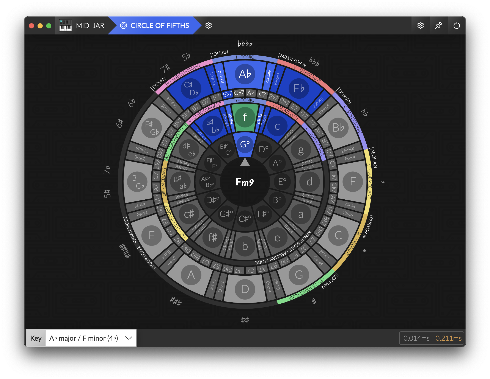

# [MIDI Jar](https://github.com/la-jarre-a-son/midi-jar)

MIDI Jar is a tool box for musicians, learners, streamers, that want to route MIDI message between devices, and display a piano or monitor chords while playing, and integrate it on a video or on a Twitch stream with OBS.


## Releases

Check out the releases on Github: [Releases](https://github.com/la-jarre-a-son/midi-jar/releases)

### Unsigned App

Due to code sign certificates being a bit expensive, MIDI Jar is not signed (yet?).
If you are willing to help me sign this app, financially, don't hesitate to contact me.

So to install it on **Windows**, Windows Defender may block it, and warn you that this could be dangerous. You can still execute it anyway.

On **MacOS** though, the _.dmg_ or any downloaded unsigned file will be blocked, as if "app is damaged and can’t be opened".

You will need to unquarantine the file after you downloaded, by executing in a terminal:

```
xattr -dr com.apple.quarantine <Your Downloaded File Name>
```

## Why this app ?

I needed a way to display a piano and monitor chords when i was playing, but found no solution to do it properly.
So I created a previous tool called [Chord Display](https://github.com/rednetio/chord-display) to do it in a Web browser, but due to Windows having exclusive MIDI (only one software can use the same MIDI device at a time), I needed a new solution.
Plus, OBS BrowserSource is unable to use MIDI devices, so integrating it in a Twitch stream was not possible.

MIDI Jar fixes all theses issues as a Standalone Desktop Application made with Electron.

## Features

MIDI Jar includes:

- MIDI routing between devices and internal modules
- A Chord Display module, to display a piano and monitor chords being played
- A Circle of Fifths highly customizatble
- A Chord Quiz module, with different modes and settings to train
- A HTTP/Websocket server to include modules externally (in OBS Browser source for instance)
- Running at startup
- Running in background (no window, only Tray icon)

## Routing

You can route MIDI between devices, or to internal and external modules of MIDI Jar, and MIDI messages will be routed when the application is running.

This can be a simple alternative to replace complex softwares like **MIDI-OX** if you _just_ want to route messages from a device to another.

### NOTE FOR WINDOWS USERS:

Windows Standard MIDI drivers are exclusive, only one software can be connected to a device at the same time.

**If you want to use MIDI Jar with other sofwares like your DAW, or a Standalone VST, you should install [loopMIDI](https://www.tobias-erichsen.de/software/loopmidi.html) by Tobias Erichsen.**

You will be able to create multiple Virtual MIDI devices (loopbacks) and route MIDI messages to it. Plus, those virtual devices are non-exclusive, so multiple softwares can use them.


### Latency

MIDI Jar may introduce latency to MIDI messages. I did my best to keep it as low as possible, in the Routing settings page you can see the latency that is introduced by your config: this is only the latency added to the existing latency, from when MIDI Jar receives a message, and forwarded it to other devices and modules.

Any other latency (due to USB, your device drivers or LoopMidi loopback) is not taken into account.

My tests had an `average additional latency < 0.2ms` but this can vary a lot with PC configuration, routing, and CPU Usage, and some freezes could occur.

## Chord Display

Chord Display is a module of MIDI Jar for displaying a piano keyboard and the chords played.

It is based on [tonal](https://github.com/tonaljs/tonal), but with a custom chord dictionary and a modified chord detection feature that allows omissions of intervals (depending on the dictionary).

To use it, route your MIDI devices to the internal `chord-display` output.

### Music Notation

You can enable displaying the standard music notation in Chord Display.

It is implemented with [VexFlow](https://github.com/0xfe/vexflow) and supports displaying notes in any major Key.

NOTE: Key signature that would have more than 7 alterations will be changed automatically to the equivalent major key (e.g. `G#` will produce a key signature of `Ab`).

**DISCLAIMER: As i am not really into reading and writing music, Chord Display notation could be wrong... If so, do not hesitate to post an issue.**

### Customize in Settings

Chord Display rendering is customizable in the Settings:

- Keyboard:
  - Keyboard length: start & end note
  - Wrap: display notes outside of keyboard with a different color
  - Theme:
    - `classic` - a classical looking piano
    - `flat` - a simplified version on a single row
  - Sizes: change skin specific display sizes.
  - Colors: blacks and whites, played & sustained & wrapped notes.
  - Enabling some infos on the piano:
    - `key names` - name displayed on keys (none, only C, pitch class or note)
    - `key info` - additional info display on keys (none, tonic dot, chord intervals)
    - `label`- additional info display above played keys (none, pitch class, note, chord interval)
  - Fade out duration: key disappear with a delay on release
  - Sustained notes: can be disabled on display
- Customizing elements:
  - `chord` - the detected chord
  - `alternative chords` - a list of other detected chord names if any
  - `chord name` - full name of the chord
  - `chord notation` - choose how chords are notated
    - `long` - maj, min, dom, dim, aug
    - `short` - M, m, dim, aug
    - `symbol` - Δ, -, °, +
  - `allow omissions` - detect chords with omitted intervals (like 5P, 9M and 11P)
  - `use sustain` - should sustained notes be used in detection (also disables display of sustained notes)
  - `highlight chord alterations` - display chord parts more distinctly
  - `notation` - the staff notation of the played notes
  - `piano` - a keyboard displaying your played notes
  - `intervals` - a list of intervals that constitutes the chord

### Customize via CSS

OBS Browser Source let you inject any CSS in the page, so you can add any style to existing layout, like:

Disable Background image:
```css
body { background: none !important; color: white; }
```

Remove detected Chord:

```css
#chord {
  display: none;
}
```

Remove Bass Note / Slash chord notation:

```css
.chord-root {
  display: none;
}
```

Remove played Notes:

```css
#notes {
  display: none;
}
```

Remove piano keyboard:

```css
#keyboard {
  display: none;
}
```

Change display order:

```css
#keyboard {
  order: 1;
}
#container {
  order: 2;
}
#notes {
  order: 3;
}
#intervals {
  order: 4;
}
```

Change Text Color:

```css
body {
  color: #fff;
  background: transparent;
}
```

Change chord size and placement:

```css
#chordDisplay {
  align-items: flex-end;
  justify-content: flex-end;
  padding: 2vh;
  flex-direction: column-reverse;
}

#container {
  align-items: flex-start;
  justify-content: space-between;
}

#chord {
  flex-grow: 0;
  font-size: 10vh;
}

#notes {
  display: none;
}

#alternativeChords {
  display: none;
}

#intervals {
  font-size: 2vh;
}

#notation {
  color: black;
  width: 300px;
  height: 300px;
  background: rgba(255, 255, 255, 0.3);
  border-radius: 32px;
  margin-top: 16px;
}
```

## Circle of Fifths

The Circle of Fifths is a music theory tool to help understanding and writing music.

This modules let you choose easily the Key signature you are playing in, and displaying notes.



It will react (in green), at your choosing:

- `on Chords`: the circle sector that corresponds the most to the currently played chord will be highlighted
- `on Notes`: all sectors that represent the played notes will be highlighted

You can customize its rendering by adding/removing sections of the wheel:

- `Display Major`: displays the circle of major fifths
- `Display Minor`: displays the circle of minor fifths
- `Display Diminished`: displays the circle of diminished fifths
- `Main Scale`: choose which of Major or Minor is displayed first in the circle
- `Display Dominant Chords`: Adds a section containing for each key, the corresponding dominant chords (and substitutions) - V7, bVII7, bII7 and III7
- `Display Suspended Chords`: adds sectors around each minor and major key that are suspended. Their position corresponds to their inversion in the adjacent fifths (e.g.: Csus2 can be inverted as a Gsus4 so it is placed between C and G).
- `Display Alterations`: displays the number of ♭ or ♯ of the coresponding key signature
- `Display Modes`: displays the enharmonic modes above the corresponding keys (e.g. when in C ionian, the next fifth enharmonic mode is G mixolydian)
- `Display Degree`: adds labels for each fifth with its degree and its name
- `Display Degree Label`: adds degree inside the key sectors. Left is major degree, right is minor degree.
- `Highlight Sectors in the key`: shows in blue the sectors in the currently selected key scale

_NOTE: The Circle of Fifths is usually for displaying notes, not chords. But i found that it was also suited for chords, and particularly visualizing resolutions between degrees. Any chord in a same angular part of the circle will tend to resolve to the first degree in the scale. This module is more a personal vision than a standard representation. Don't hesitate to disable the sections you don't need._

## HTTP/WS Server - Overlay

It enables integrating modules in an external web browser, or in an OBS Browser Source. For instance, you can integrate MIDI Jar in your Twitch stream, or load it on a different computer or phone for displaying chords while jamming, and even use it as a Desktop Wallpaper using [Lively Wallpaper](https://rocksdanister.github.io/lively/).

Chord Display module has dedicated settings if you need a different rendering when using external access, and they are automatically synced when you change them.

To use it, route your MIDI devices to the overlay `chord-display` output.

## Music Notation

Music Notation can be displayed in the Chord Display module and changed through the Circle of Fifths.

You can customize it in the settings, and this will affect all modules (including the overlay)::

- `Key Signature`: the key signature to display notes in, and for choosing the key in staff notation.
- `Accidentals (when in C Key)`: displays `flats` ♭ or `sharps` ♯
- `Staff Clef`: the Clef to display in staff notation
- `Staff Transpose (in semitones)`: transcribes notes for transposing instruments

## Chord Quiz

[MIDI Jar - Chord Quiz example](https://user-images.githubusercontent.com/1231011/233844786-4f182b44-fcb8-4d24-b69d-532c6286f61e.mp4)

You can train piano by using the Chord Quiz module.

Each round of a game you will be prompted a chord that you must play, and will also see the next chord to play (to anticipate your finger movements).

Your answer will be committed when you release all the keys, and can result to different score for the round:

- `different`: You did not play the right chord - you will lose points
- `subset`: You played some intervals of the chord - you will not gain all the points
- `exact`: you played the chord that was asked
- `superset`: you played additional interval that were not asked (and it is considered as a bonus)

Any addition, repetition, or inversions of a chord will grant you additional points.

You can choose which mode (algorithm) to play with:

- `random`: All chords will be picked randomly, in a random key signature
- `random in key`: All chords will be picked from the current key signature (in Notation settings), in the major scale + additions (melodic and harmonic alterations).

And finally, to adapt your training, you can choose the difficulty, each levels adds new chords to the possible list:

- `Very Easy`: maj, min
- `Easy`: maj7, majadd2, majadd4, maj6, min7, min6, minadd9, minadd4, minmaj7, dom7, sus4, sus2
- `Medium`: maj9, maj11, maj13, majaddb2, majadd#4, majaddb6, maj6/9, maj6add11, maj6/11, maj7add11, maj7add13, majb5, majb9, min9, min11, min13, minaddb2, min6/9, min7add11, minaddb6, min#5, minb9, minmaj9, minmaj11, minmaj13, minmaj7b9, minmaj7add11, dim, dim7, dom9, dom11, dom13, dom7add6, dom7add11, dom7b9, sus2sus4, sus2maj7, sus4maj7, dom7sus2, dom7sus4, dom9sus4, aug
- `Hard`: maj6#11, maj7add#11, maj7addb13, maj7b5, maj#9, maj#11, maj11b9, minaddb6addb9, min7#5, minb11, min#11, min7#11, min11b13, minmaj7#5, minmaj7addb13, minmaj7b11, minmaj7#11, dimmaj7, dim7maj7, min7b5, dom7b5, dom7add#11, dom7addb13, dom7#9, dom11b9, dom13b9, sus2maj11, sus2maj7add13, sus4maj13, dom7sus4b9, dom13sus4, aug7, augmaj7, augaddb9, augadd9
- `Very Hard`: maj6/9add#11, maj9b5, maj9#9, majb9#9, maj#11b9, maj11#9, maj13#11, min9#5, min11#5, min13#5, min11b11, minmaj9addb13, minmaj11addb13, minmaj9#11, minmaj11b11, min9b5, min7b5b9, min11b5, dom9b5, dom11b5, dom13b5, dom9#11, dom9addb13, dom7b9#9, dom7b9#11, dom7b9b13, dom11b13, dom13#9, dom13#11, dom11susb2, dom7sus4addb13, aug9, aug11, aug13, augmaj9, augadd#9, augmaj7b9, aug7b9, augsus4add7
- `All Chords`: the rest of the dictionary

If the game mode is too annoying, you can turn off the scoring, the reactions, and choose to display or not the asked intervals, but have in mind that the gamification is only for fun, there is no persistent scoreboard or high score, it's only a tool to help exploration.

Hopefully in the future, this module will be able to have an "Intelligent" mode capable of generating random chord progressions with key changes.

## What then ?

### Build

This project is built with Electron & Webpack:

```
npm install

npm run start
 -or-
npm run package
```

### Planned features / Ideas

- [x] Simple Routing (v1)
- [x] Chord Display (v1)
- [x] HTTP/WS overlay for OBS (v1)
- [x] Display Standard notation
- [x] Circle of Fifths
- [x] Chords Quiz
- [ ] Tonnetz chart
- [ ] More Keyboard themes
- [ ] Virtual Keyboard (use pc keyboard as a MIDI device)
- [ ] Visualizations / Vertical scrolling notes
- [ ] Soundboard
- [ ] MIDI recording (playback/backup)
- [ ] Chromesthesia
- [ ] Advanced Routing (split keyboard, filter, velocity/value remapping)

### Contribute / Bugs

This project is fully open to contribution and it would be appreciated to have some feedbacks and new ideas.
Please feel free to open an issue or open a Merge request.

For any UI or UX bug, please [Open an issue](https://github.com/la-jarre-a-son/midi-jar/issues).

If you discover unexpected Chord detection, please see [tonaljs/tonal issues](https://github.com/tonaljs/tonal/issues) and contribute to make it work perfectly.

### Credits

- [tonal](https://github.com/tonaljs/tonal): A functional music theory library for Javascript, that detects chords, and handles MIDI notes
- [VexFlow](https://github.com/0xfe/vexflow): A JavaScript library for rendering music notation and guitar tablature.
- [node-midi](https://github.com/justinlatimer/node-midi) / [@julusian/midi](https://github.com/Julusian/node-midi): A node.js wrapper for the RtMidi C++ library that provides realtime MIDI I/O.
- [React Flow](https://github.com/wbkd/react-flow): Highly customizable library for building interactive node-based UIs, editors, flow charts and diagrams. It allows MIDI Jar to have understandable MIDI routing with nodes and draggable edges.
- [React Electron Boilerplate](https://github.com/electron-react-boilerplate/electron-react-boilerplate): A Foundation for Scalable Cross-Platform Apps in Electron, the base boilerplate for MIDI Jar.
